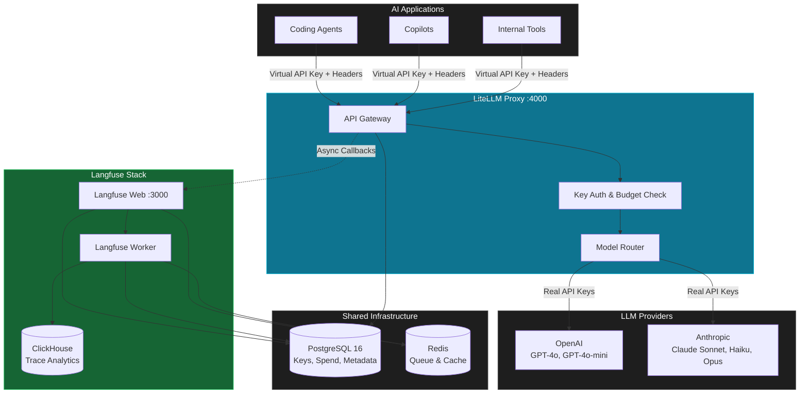

# Ops Gateway — Enterprise AI Operations Mission Control

A centralized operations control layer for all corporate AI applications and coding agents. Self-hosted, open-source, production-ready.

**Gateway** · **Observability** · **Budget Control** · **Team Management**

---

## Architecture



## What It Does

| Capability | How |
|---|---|
| **Unified API Gateway** | All AI requests route through LiteLLM Proxy on `:4000`. One endpoint, one format (OpenAI-compatible). |
| **Virtual Key Management** | Issue scoped API keys per team. Real provider keys never leave the gateway. |
| **Budget Enforcement** | Set per-team monthly spend limits. Requests exceeding budget are rejected automatically. |
| **Deep Observability** | Every prompt, response, tool call, and token count is traced in Langfuse. |
| **Multi-Step Agent Tracing** | Correlate multi-step agent workflows into single trace trees via `X-Trace-ID` headers. |
| **No-Bypass Compliance** | `allow_dynamic_callback_disabling: false` — developers cannot skip logging. |

## Stack

| Service | Image | Port | Role |
|---|---|---|---|
| LiteLLM Proxy | `ghcr.io/berriai/litellm:main-stable` | 4000 | AI Gateway & Admin UI |
| Langfuse Web | `langfuse/langfuse:3` | 3000 | Observability UI |
| Langfuse Worker | `langfuse/langfuse-worker:3` | — | Background trace processing |
| PostgreSQL 16 | `postgres:16-alpine` | — | Metadata, keys, spend logs |
| ClickHouse | `clickhouse/clickhouse-server:24.8` | — | Analytical trace storage |
| Redis | `redis:7-alpine` | — | Queue & cache |

## Quick Start

### Prerequisites

- Docker 24+ with Compose v2
- Python 3.11+ (for provisioning scripts)
- At least one AI provider API key (OpenAI or Anthropic)

### 1. Clone & Configure

```bash
git clone https://github.com/kelim19/ops-gateway
cd ops-gateway
cp .env.example .env
```

Edit `.env` with your settings:

```env
# Required — set real values
POSTGRES_PASSWORD=your-strong-password
LITELLM_MASTER_KEY=sk-your-master-key
LANGFUSE_SECRET_KEY=sk-lf-your-secret
LANGFUSE_PUBLIC_KEY=pk-lf-your-public
LANGFUSE_SALT=random-salt-string
NEXTAUTH_SECRET=random-session-secret

# At least one provider key
OPENAI_API_KEY=sk-your-openai-key
ANTHROPIC_API_KEY=sk-ant-your-anthropic-key
```

### 2. Launch

```bash
docker compose up -d
```

Wait ~60 seconds for database migrations on first boot. Check status:

```bash
docker compose ps
```

### 3. Access the UIs

| UI | URL | Credentials |
|---|---|---|
| **LiteLLM Admin** | [http://localhost:4000/ui](http://localhost:4000/ui) | Master key from `.env` |
| **Langfuse** | [http://localhost:3000](http://localhost:3000) | Init email/password from `.env` |

### 4. Provision Teams & Keys

```bash
pip install -r scripts/requirements.txt
python scripts/setup_gateway.py
```

This creates two sample teams with budget limits:

| Team | Budget | Models |
|---|---|---|
| `support-engineering` | $50/month | gpt-4o, gpt-4o-mini, claude-sonnet-4, claude-haiku-4 |
| `marketing-automation` | $20/month | gpt-4o-mini, claude-haiku-4 |

Save the virtual API keys printed to stdout.

### 5. Run Agent Simulation

```bash
export OPS_GATEWAY_API_KEY=sk-team-key-from-step-4
python scripts/test_agent_simulation.py
```

After completion, check Langfuse for the full trace tree.

## Models

Configured in `config/litellm_config.yaml`:

| Model Name | Provider | Model ID |
|---|---|---|
| `gpt-4o` | OpenAI | `openai/gpt-4o` |
| `gpt-4o-mini` | OpenAI | `openai/gpt-4o-mini` |
| `claude-sonnet-4` | Anthropic | `anthropic/claude-sonnet-4-20250514` |
| `claude-haiku-4` | Anthropic | `anthropic/claude-haiku-4-5-20251001` |
| `claude-opus-4` | Anthropic | `anthropic/claude-opus-4-20250514` |

Add models by editing the config and restarting: `docker compose restart litellm`.

## Metadata Headers

Tag requests for cost attribution and trace correlation:

```bash
curl http://localhost:4000/chat/completions \
  -H "Authorization: Bearer sk-team-key" \
  -H "X-Team-ID: support-engineering" \
  -H "X-App-ID: my-app" \
  -H "X-Trace-ID: trace-abc-123" \
  -d '{"model": "gpt-4o-mini", "messages": [{"role": "user", "content": "Hello"}]}'
```

| Header | Purpose |
|---|---|
| `X-Team-ID` | Team identifier for budget tracking |
| `X-App-ID` | Application/service identifier |
| `X-Trace-ID` | Correlation ID for multi-step traces |

## Design Decisions

1. **Shared PostgreSQL** — Single Postgres instance for both LiteLLM and Langfuse. Simplifies ops for small-to-medium deployments. Scale to separate instances when needed.

2. **ClickHouse for Analytics** — Columnar storage for trace data enables fast aggregations across millions of spans without impacting transactional Postgres.

3. **Async Telemetry** — LiteLLM sends traces to Langfuse via background callbacks, not inline. Zero latency impact on production requests.

4. **No Dynamic Callback Disabling** — Compliance enforcement. Every request is logged — no developer can bypass tracing.

5. **Virtual Keys Only** — Teams never see real provider API keys. Rotation, revocation, and migration happen at the gateway layer without downstream changes.

6. **Health-Check Boot Order** — `depends_on` with `service_healthy` conditions ensures Postgres, ClickHouse, and Redis are ready before dependent services start.

## Repository Structure

```
.
├── docker-compose.yml           # Full stack orchestration
├── config/
│   └── litellm_config.yaml      # Model routing & gateway settings
├── scripts/
│   ├── requirements.txt         # Python dependencies
│   ├── setup_gateway.py         # Team & key provisioning
│   └── test_agent_simulation.py # Agent workflow verification
├── portal/                      # Next.js Mission Control dashboard
├── .env.example                 # Environment template
└── README.md                    # This file
```

## Troubleshooting

| Problem | Solution |
|---|---|
| Services won't start | Run `docker compose logs <service>`. Ensure ports 3000/4000 are free. |
| LiteLLM 401 errors | Verify `LITELLM_MASTER_KEY` in `.env`. For virtual keys, run `setup_gateway.py` first. |
| Traces missing in Langfuse | Check `LANGFUSE_PUBLIC_KEY`/`LANGFUSE_SECRET_KEY` match in both services. Verify worker is running. |
| Provider API errors | Verify provider keys in `.env` are valid. Check `docker compose logs litellm`. |
| Database migration errors | Delete volumes and restart: `docker compose down -v && docker compose up -d` |

## License

MIT
